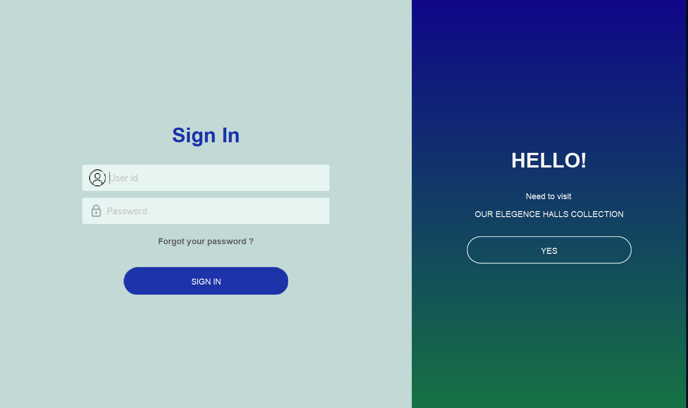
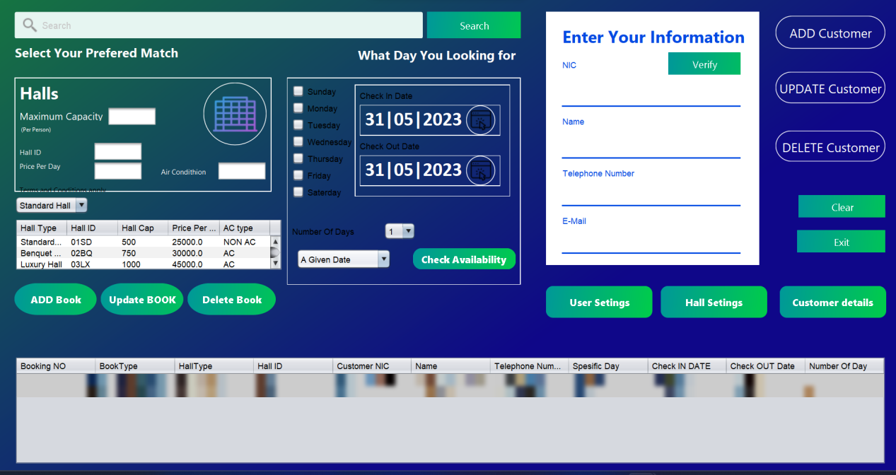
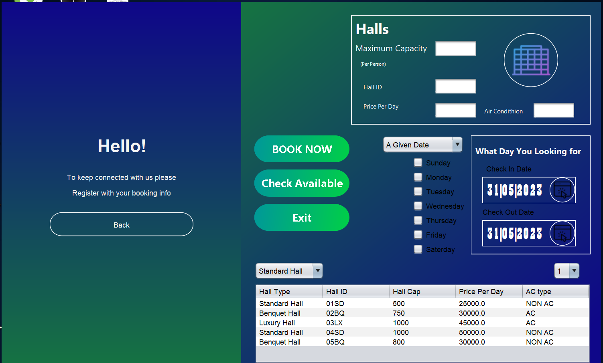
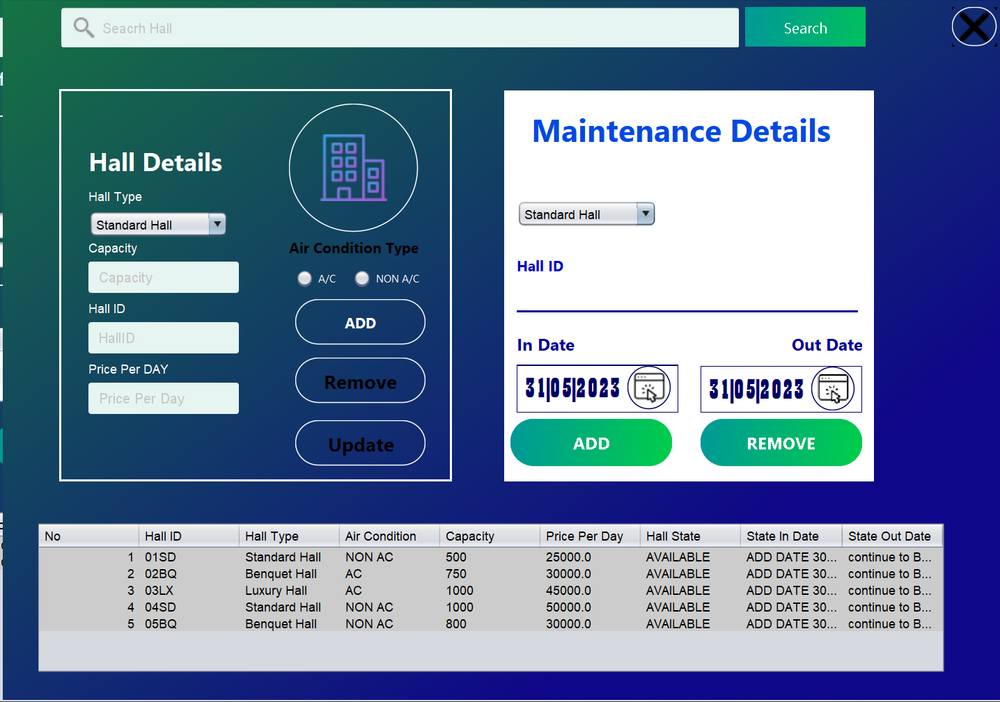
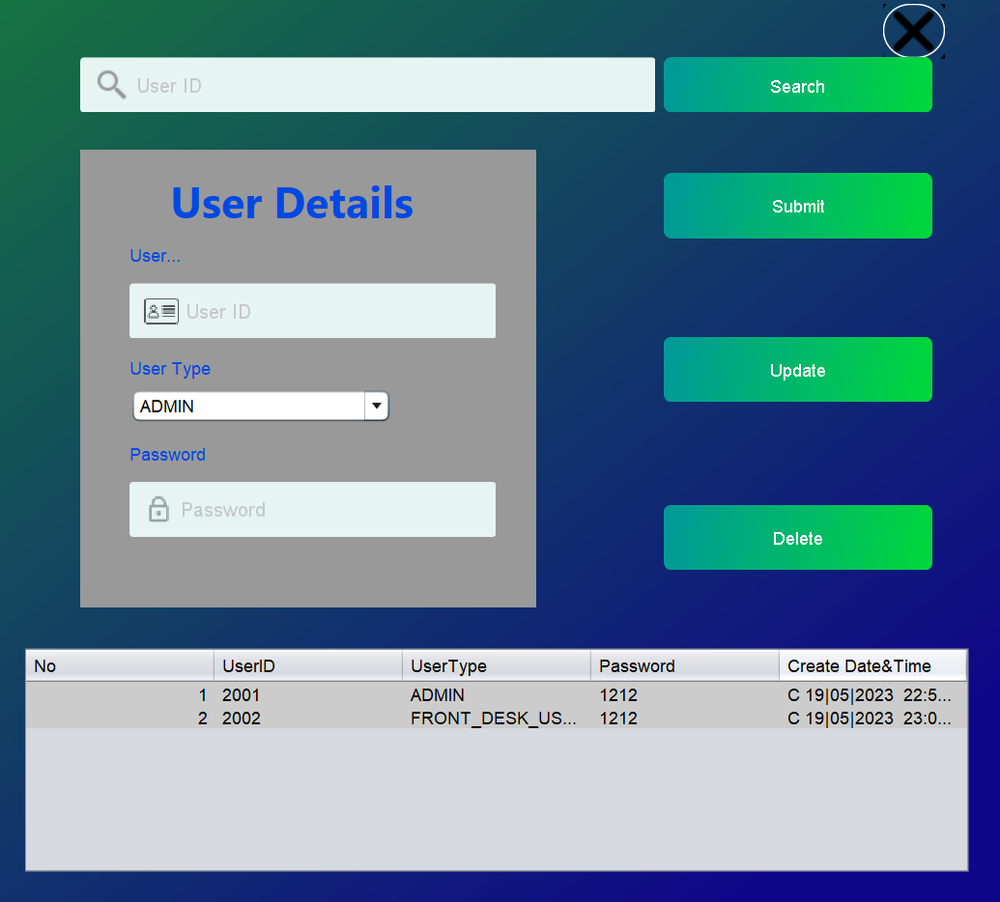
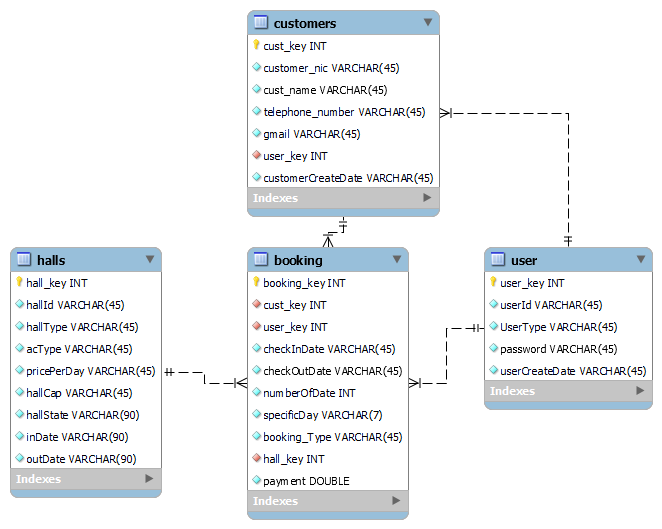

# ABC Hall Reservation System

[](https://github.com/YasithaNV2001/ABC-Hall-Reservation-System/actions/workflows/build.yml)

A desktop application for managing hall bookings, built with **Java Swing** and **MySQL**.

Built in 2023 as my first-year Object-Oriented Programming module project at the **University of Sri Jayewardenepura (USJP)**, and uploaded to GitHub in 2026.



## Features

**Admin**
- Add, update, remove and search halls (Standard, Luxury and Banquet; AC or non-AC)
- Put halls under maintenance for a date range; hall status updates automatically
- Create and manage system users (Admin / Front Desk)

**Front Desk / Admin**
- Register, update, search and delete customers (verified by NIC)
- Check hall availability for a date range or specific days of the week
- Create, update and cancel bookings with automatic payment calculation per hall type

**Customer view**
- Browse halls by type and check availability for chosen dates

## Tech Stack

| Area | Technology |
|---|---|
| Language | Java 19 |
| UI | Java Swing, MigLayout, TimingFramework (animations) |
| Database | MySQL 8.0 via JDBC (`PreparedStatement`) |
| IDE / Build | Apache NetBeans, Ant |

## OOP Design

- **Abstraction and inheritance:** abstract `Hall` class with `StanderdHalls`, `LuxuryHalls` and `BenquetHalls` subclasses, each with its own `calcPayment()` / `cancelPayment()`
- **Interfaces:** `UserInterface` defines the availability, customer and booking operations, implemented by `UserControler`, `AdminControler` and `CustomerControler`
- **Inheritance:** `Admin` extends `User`, and `AdminControler` extends `UserControler` to add hall and user management
- **Enums:** `UserType` for role-based access (Admin / Front Desk)
- **MVC-style structure:** `model`, `view` and `controller` packages, with database access in `database`

## Screenshots

| Booking dashboard | Customer view |
|---|---|
|  |  |

| Hall settings | User settings |
|---|---|
|  |  |

## Design Diagrams

- [Class diagram](docs/diagrams/class-diagram.png)
- [Use case diagram](docs/diagrams/use-case-diagram.png)
- [Database diagram](docs/diagrams/database-diagram.png)



## Getting Started

### Requirements
- JDK 19 or newer
- MySQL 8.0
- Apache NetBeans (recommended)

Required libraries (MySQL Connector/J, MigLayout, TimingFramework) are included in the `lib/` folder.

### Setup
1. Clone the repository:
   ```bash
   git clone https://github.com/YasithaNV2001/ABC-Hall-Reservation-System.git
   ```
2. Create the database with sample data:
   ```bash
   mysql -u root -p < database/schema.sql
   ```
3. Update the database username and password in `src/com/abc/database/hallDb.java` if yours are different from `root` / `root`.
4. Open the project in NetBeans and run it (main class: `com.abc.view.main.MainLoginForm`).

### Sample logins

| User ID | Password | Role |
|---|---|---|
| 2001 | 1212 | Admin |
| 2002 | 1212 | Front Desk |

All customer and booking records in `schema.sql` are fictional sample data.

## Author

**Yasitha NV** – [GitHub](https://github.com/YasithaNV2001)
